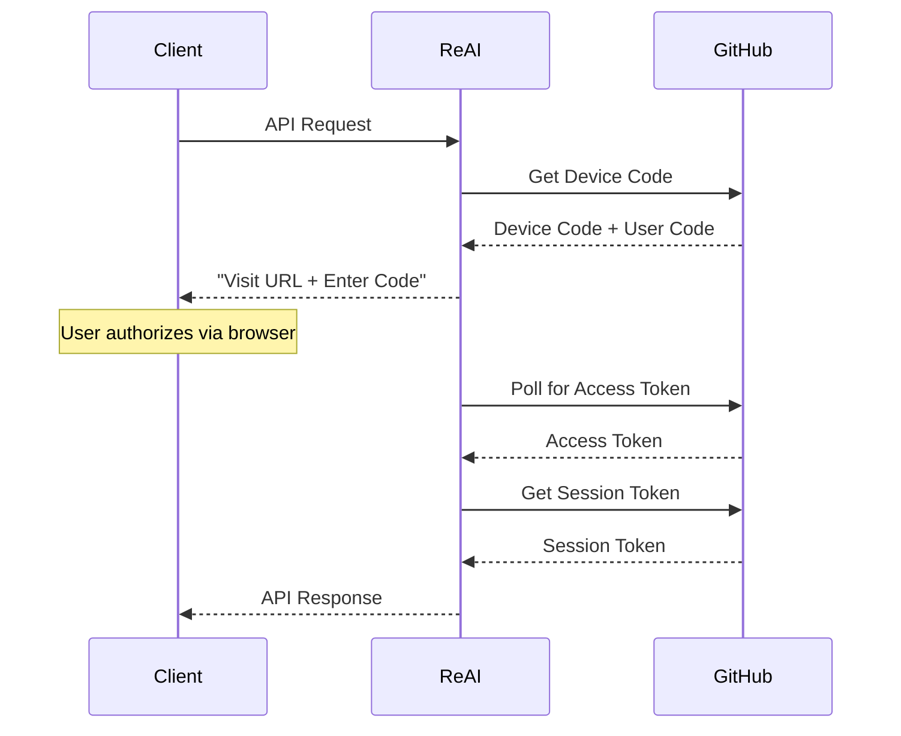

# 🚀 ReAI - OpenAI Compatible GitHub Copilot API Server

[](https://golang.org)
[](https://docker.com)
[](LICENSE)
[](https://platform.openai.com/docs/api-reference)

> **ReAI** is a reverse-engineered GitHub Copilot API server that provides OpenAI-compatible endpoints for code completion, chat, and AI-powered development assistance. Built with Go, it offers seamless integration with existing OpenAI-compatible tools and libraries.

## 🌟 Features

### 🔥 Core Capabilities
- **OpenAI-Compatible API** - Drop-in replacement for OpenAI API endpoints
- **Code Completions** - Intelligent code suggestions powered by GitHub Copilot
- **Chat Interface** - AI-powered Q&A and coding assistance  
- **Streaming Support** - Real-time response streaming
- **Multi-Language Support** - Support for multiple programming languages
- **GitHub OAuth** - Secure authentication with GitHub accounts

### 🛠️ Technical Features
- **High Performance** - Built with Go for optimal performance
- **Docker Ready** - Complete containerization with Docker & Docker Compose
- **Structured Logging** - JSON-based logging with configurable levels
- **Health Monitoring** - Built-in health checks and monitoring
- **Rate Limiting** - Configurable request rate limiting
- **Token Management** - Automatic token refresh and session management
- **Graceful Shutdown** - Clean shutdown with proper resource cleanup

### 🔌 API Endpoints
- `GET /health` - Health check endpoint
- `GET /v1/models` - List available AI models
- `POST /v1/completions` - Code completion requests
- `POST /v1/completions/stream` - Streaming code completions
- `POST /v1/chat/completions` - Chat/Q&A interface
- `POST /v1/edits` - Code editing suggestions
- `POST /v1/agent` - Agent-based tasks

## 📦 Project Structure

```
devs-ai/
├── cmd/
│   └── server/
│       └── main.go              # Application entry point
├── internal/
│   ├── api/
│   │   ├── server.go           # HTTP server and routing
│   │   └── middleware.go       # HTTP middleware
│   ├── config/
│   │   └── config.go          # Configuration management
│   └── copilot/
│       ├── client.go          # GitHub Copilot client
│       ├── completions.go     # Code completion logic
│       └── models.go          # Model management
├── pkg/
│   └── errors/
│       └── errors.go          # Error handling utilities
├── web/                       # Static web assets (if any)
├── bin/                       # Compiled binaries
├── docker-compose.yml         # Docker Compose configuration
├── Dockerfile                 # Docker build configuration
├── docker.sh                  # Docker management script
├── go.mod                     # Go module definition
└── README.md                  # This file
```

## 🚀 Quick Start

### Prerequisites
- **Go 1.24.5+** (for local development)
- **Docker & Docker Compose** (for containerized deployment)
- **GitHub Account** (for Copilot access)
- **curl** or **wget** (for testing)

### 🐳 Docker Deployment (Recommended)

1. **Clone the repository:**
```bash
git clone https://github.com/devstroop/reai.git
cd reai
```

2. **Start with Docker Compose:**
```bash
# Make the Docker script executable
chmod +x docker.sh

# Build and start the application
./docker.sh build
./docker.sh start
```

3. **Verify the deployment:**
```bash
# Check application health
./docker.sh health

# View logs
./docker.sh logs
```

The server will be available at `http://localhost:8080`

### 🔧 Local Development

1. **Clone and setup:**
```bash
git clone https://github.com/devstroop/reai.git
cd reai
go mod tidy
```

2. **Build the application:**
```bash
go build -o bin/reai ./cmd/server
```

3. **Run the server:**
```bash
./bin/reai
```

## ⚙️ Configuration

### Environment Variables

| Variable | Default | Description |
|----------|---------|-------------|
| `PORT` | `8080` | Server port |
| `DATA_DIR` | `~/.local/share/reai` | Data directory for tokens |
| `LOG_LEVEL` | `info` | Logging level (`debug`, `info`, `warn`, `error`) |
| `COPILOT_CLIENT_ID` | Built-in | GitHub OAuth client ID |
| `RATE_LIMIT` | `100` | Maximum concurrent requests |
| `MAX_PROMPT_LENGTH` | `8192` | Maximum prompt length in characters |

### Docker Compose Configuration

```yaml
environment:
  - PORT=8080
  - DATA_DIR=/app/data
  - LOG_LEVEL=info
  - RATE_LIMIT=100
  - MAX_PROMPT_LENGTH=8192
```

## 🔐 Authentication Setup

### First-Time Setup

1. **Start the server** (Docker or locally)

2. **Make your first API request** - this will trigger the authentication flow:
```bash
curl http://localhost:8080/v1/models
```

3. **Follow the authentication prompts:**
   - Visit the GitHub device authorization URL
   - Enter the provided user code
   - Authorize the application

4. **Authentication is complete** - tokens are automatically saved and managed

### Authentication Flow


## 📚 API Usage

### Code Completions

```bash
curl -X POST http://localhost:8080/v1/completions \
  -H "Content-Type: application/json" \
  -d '{
    "prompt": "function fibonacci(n) {",
    "language": "javascript",
    "max_tokens": 100,
    "temperature": 0.1
  }'
```

### Chat Completions

```bash
curl -X POST http://localhost:8080/v1/chat/completions \
  -H "Content-Type: application/json" \
  -d '{
    "model": "gpt-4",
    "messages": [
      {"role": "user", "content": "How do I implement a binary search in Python?"}
    ],
    "max_tokens": 500
  }'
```

### List Models

```bash
curl http://localhost:8080/v1/models
```

### Health Check

```bash
curl http://localhost:8080/health
```

## 🐳 Docker Commands

The included `docker.sh` script provides convenient Docker management:

```bash
# Build the image
./docker.sh build

# Start the application
./docker.sh start

# Stop the application
./docker.sh stop

# Restart the application
./docker.sh restart

# View logs
./docker.sh logs

# Check status
./docker.sh status

# Open shell in container
./docker.sh shell

# Check application health
./docker.sh health

# Clean up everything
./docker.sh clean

# Show help
./docker.sh help
```

## 🔧 Development

### Building from Source

```bash
# Install dependencies
go mod tidy

# Run tests
go test ./...

# Build for current platform
go build -o bin/reai ./cmd/server

# Cross-compile for Linux
CGO_ENABLED=0 GOOS=linux go build -a -installsuffix cgo -o bin/reai-linux ./cmd/server
```

### Code Structure

- **`cmd/server/`** - Application entry point and initialization
- **`internal/api/`** - HTTP server, routing, and API handlers
- **`internal/config/`** - Configuration management and environment variables
- **`internal/copilot/`** - GitHub Copilot client and API integration
- **`pkg/errors/`** - Error handling and API error responses

### Adding New Endpoints

1. Add handler in `internal/api/server.go`
2. Register route in the `Router()` method
3. Implement corresponding Copilot client method if needed
4. Add error handling using `pkg/errors`
5. Update this README with the new endpoint

## 🛡️ Security Considerations

### Authentication
- Uses OAuth 2.0 device flow for secure GitHub authentication
- Tokens are stored securely in the configured data directory
- Automatic token refresh prevents expired sessions

### Rate Limiting
- Configurable rate limiting prevents abuse
- Default limit: 100 concurrent requests
- Prompt length validation prevents oversized requests

### Docker Security
- Runs as non-root user (UID 1001)
- Minimal Alpine Linux base image
- No unnecessary packages or tools included

## 📊 Monitoring & Observability

### Health Checks
- Built-in health endpoint: `/health`
- Docker health checks configured
- Returns service status and version information

### Logging
- Structured JSON logging
- Configurable log levels
- Request/response logging with proper sanitization
- Error tracking and debugging information

### Metrics
The application provides detailed logging for:
- Request processing times
- Authentication events
- Token refresh operations
- API error rates
- Model availability

## 🚨 Troubleshooting

### Common Issues

**Authentication Failures:**
```bash
# Check if tokens exist
ls -la ~/.local/share/reai/

# View detailed logs
LOG_LEVEL=debug ./bin/reai
```

**Docker Issues:**
```bash
# Check container status
./docker.sh status

# View application logs
./docker.sh logs

# Restart the application
./docker.sh restart
```

**API Errors:**
```bash
# Test basic connectivity
curl http://localhost:8080/health

# Check GitHub Copilot access
curl http://localhost:8080/v1/models
```

### Debug Mode

Enable debug logging for detailed troubleshooting:

```bash
# Local development
LOG_LEVEL=debug ./bin/reai

# Docker Compose
# Edit docker-compose.yml:
environment:
  - LOG_LEVEL=debug
```

## 🤝 Contributing

1. **Fork the repository**
2. **Create a feature branch:** `git checkout -b feature/amazing-feature`
3. **Commit changes:** `git commit -m 'Add amazing feature'`
4. **Push to branch:** `git push origin feature/amazing-feature`
5. **Open a Pull Request**

### Development Guidelines
- Follow Go coding standards
- Add tests for new functionality
- Update documentation for API changes
- Ensure Docker builds work correctly
- Test authentication flows

## 📄 License

This project is licensed under the MIT License - see the [LICENSE](LICENSE) file for details.

## ⚠️ Disclaimer

This project is a reverse-engineered implementation of GitHub Copilot's API. It is intended for educational and development purposes. Please ensure you have appropriate GitHub Copilot access and comply with GitHub's terms of service.

## 🙏 Acknowledgments

- **GitHub Copilot** - For the amazing AI-powered coding assistance
- **OpenAI** - For the API standard and format
- **Go Community** - For the excellent tooling and libraries
- **Docker** - For containerization technology

---

**Built with ❤️ by the ReAI Team**

For questions, issues, or contributions, please visit our [GitHub repository](https://github.com/devstroop/reai).
